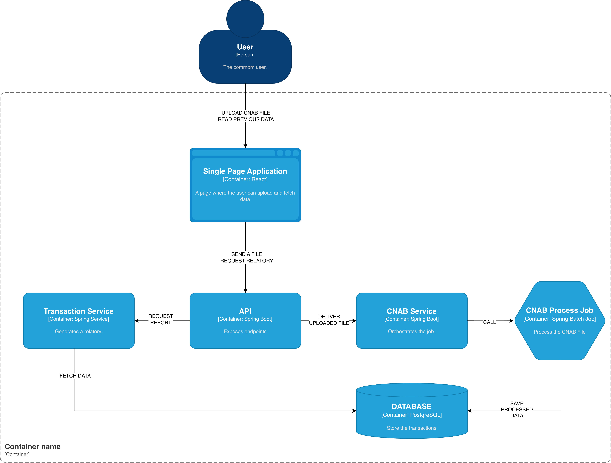

# CNAB Processor



A CNAB file processing application built with **Spring Boot** and **Spring Batch**, with a **ReactJS frontend** for file upload and data visualization.

This project was developed while following a learning series by Giuliana Bezerra, with additional improvements and adaptations.

---

## Features

- Upload CNAB files through a web interface
- Process financial transactions using Spring Batch jobs
- Store processed data in a PostgreSQL database
- Generate transaction reports
- Display processed data in a React frontend

---

## What I Learned

- Batch processing with **Spring Batch**
- Backend development with **Spring Boot**
- Handling file uploads and parsing structured files (CNAB)
- Building REST APIs and configuring **CORS**
- Basic frontend development with **ReactJS**
- Generating reports from processed data
- Containerization with **Docker**

---

## Tech Stack

**Backend**
- Java
- Spring Boot
- Spring Batch
- Spring Data JPA

**Frontend**
- ReactJS

**Database**
- PostgreSQL

**DevOps**
- Docker

---

## Project Structure
- backend/
- frontend/
- docker/


---

## How to Run

This application was dockerized with docker!

```./start.sh```

